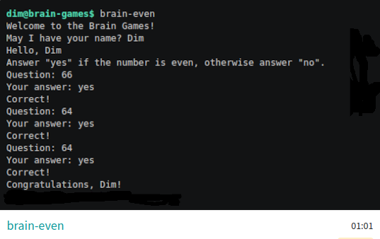
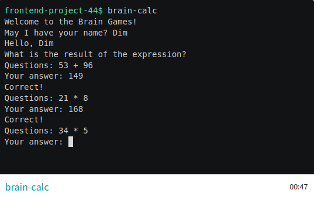
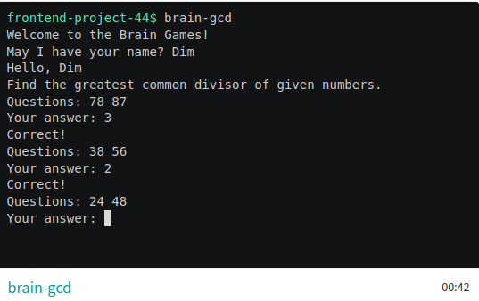
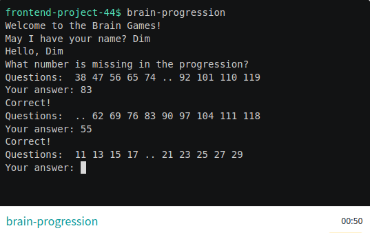
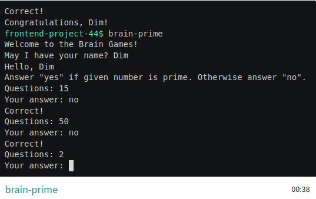

### "Игры Разума"

Набор из пяти консольных игр, построенных по принципу популярных мобильных приложений для тренировки логики.
Каждая игра задает вопросы, на которые нужно дать правильные ответы.
После трех правильных ответов считается, что игра пройдена. 
Неправильные ответы завершают игру и предлагают пройти ее заново.

### Игры

#### Проверка на четность
```bash
brain-even
```

[brain-even asciinema](https://asciinema.org/a/NHRht1sdzQhB0fOCplSz8cx73)



#### Калькулятор
```bash
brain-calc
```

[brain-calc asciinema](https://asciinema.org/a/mOel8pto4SCQDeYSYCLDY5lXr)



#### НОД (наибольший общий делитель)
```bash
brain-gcd
```

[brain-gcd asciinema](https://asciinema.org/a/szSL7SAEWxgIDbTsZ06wFJJwE)



#### Арифметическая прогрессия
```bash
brain-progression
```

[brain-progression asciinema](https://asciinema.org/a/FoQGzLY7rwhD5Y7IhzzexHW2A)



#### Простое ли число?
```bash
brain-prime
```

[brain-prime asciinema](https://asciinema.org/a/scN3EXMt2R1PrDHxQbCAA0dzF)



### Минимальные системные требования
- node - 20.15+
- npm - 10.8+

### Установка
Скопируйте репозиторий на компьютер:
```bash
git clone git@github.com:Chuvikovsky/brain-games.git
```

Перейдите в папку brain-games
```bash
cd brain-games
```

Установите необходимые зависимости:
```
make install
```

### Запуск игры
Игры можно запустить находясь и папке `brain-games` по команде:
```bash
make <GAME_NAME>
```
Игры также можно поставить глобально. После этого они будут доступны в терминале из любого места. Чтобы установить глобально, нужно находясь в папке `brain-games` ввести следующие команды:
```bash
make publish
npm link
```
После глобальной установки игра запускается `<GAME_NAME>` в терминале. Например:
```bash
brain-even
```
