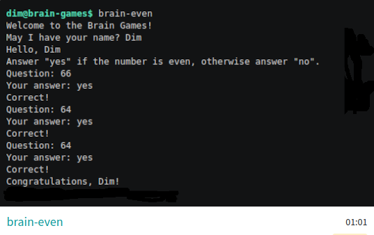
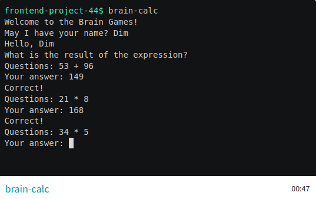
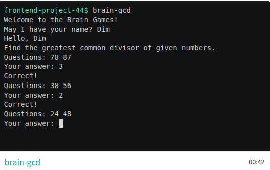
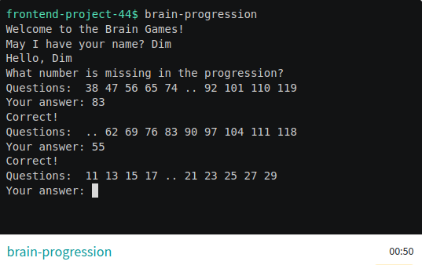
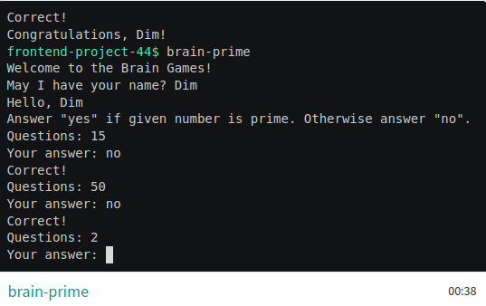

### Hexlet tests and linter status:
[](https://github.com/Chuvikovsky/frontend-project-44/actions)

### Проект "Игры Разума"

Пять простых игр в терминале по мотивам популярных мобильных игр.

### Минимальные системные требования
- node - 20.15+
- npm - 10.8+

### Установка
Скопируйте репозиторий на компьютер:
```bash
git clone git@github.com:Chuvikovsky/brain-games.git
```

Перейдите в папку brain-games
```bash
cd brain-games
```

Установите необходимые зависимости:
```
make install
```

### Запуск игры
Игры можно запустить находясь и папке `brain-games` по команде:
```bash
make <GAME_NAME>
```
Игры также можно поставить глобально. После этого они будут доступны в терминале из любого места. Чтобы установить глобально, нужно находясь в папке `brain-games` ввести следующие команды:
```bash
make publish
npm link
```
После глобальной установки игра запускается `<GAME_NAME>` в терминале. Например:
```bash
brain-even
```

### Игры

#### Проверка на четность
```bash
brain-even
```

[brain-even asciinema](https://asciinema.org/a/NHRht1sdzQhB0fOCplSz8cx73)



#### Калькулятор
```bash
brain-calc
```

[brain-calc asciinema](https://asciinema.org/a/mOel8pto4SCQDeYSYCLDY5lXr)



#### НОД (наибольший общий делитель)
```bash
brain-gcd
```

[brain-gcd asciinema](https://asciinema.org/a/szSL7SAEWxgIDbTsZ06wFJJwE)



#### Арифметическая прогрессия
```bash
brain-progression
```

[brain-progression asciinema](https://asciinema.org/a/FoQGzLY7rwhD5Y7IhzzexHW2A)



#### Простое ли число?
```bash
brain-prime
```

[brain-prime asciinema](https://asciinema.org/a/scN3EXMt2R1PrDHxQbCAA0dzF)


